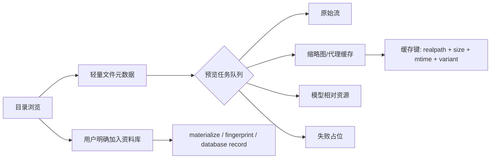

# Found 3.5.122 逆向学习与 RefCanvas 落地报告

## 1. 范围与边界

本报告只记录公开可观察的安装包静态信息、隔离进程启动结果，以及 RefCanvas 自身实现与测试结果。分析没有登录 Found 账号、没有上传或读取私人素材、没有绕过授权、没有提取或复用 Found 私有代码，也没有把 Found 的二进制实现复制到 RefCanvas。

样本：`C:\Users\lin10\Downloads\Programs\Found_3.5.122.3a3f6a11c_cn.exe`

隔离目录：`D:\AiWork\found-lab\run-20260802\`

## 2. 可重复的静态证据

### 2.1 文件与签名

| 项目 | 结果 |
| --- | --- |
| 文件大小 | 320,955,616 bytes |
| SHA-256 | `AFAD2AC4474EE939060D94AAFE018F11F2C9E00D01E5911F9545ECE617FA2FA5` |
| Authenticode | Valid；Signature verified |
| 签名主体 | 上海热素信息科技有限公司 |
| 签名证书颁发者 | GlobalSign GCC R45 EV CodeSigning CA 2020 |
| 证书指纹 | `9F9D3558DF675A7CAE548BC70DA5AB1FDAD54547` |
| PE 格式 | x64 PE32+，Machine `0x8664` |
| PE offset | `0x130` |
| PE timestamp | `2026-05-18 18:37:44` |

哈希、签名状态和 PE 表均从原始文件重新读取；报告不把文件名当作版本证明，`3.5.122` 只作为样本文件名中的版本标识。

### 2.2 PE sections

| Section | Virtual size | RVA | Raw size | Raw pointer |
| --- | ---: | ---: | ---: | ---: |
| `.text` | 1,481,112 | `0x00001000` | 1,481,216 | `0x00000400` |
| `.rdata` | 534,164 | `0x0016B000` | 534,528 | `0x00169E00` |
| `.data` | 48,324 | `0x001EE000` | 22,016 | `0x001EC600` |
| `.pdata` | 57,036 | `0x001FA000` | 57,344 | `0x001F1C00` |
| `.fptable` | 256 | `0x00208000` | 512 | `0x001FFC00` |
| `.rsrc` | 318,826,912 | `0x00209000` | 318,827,008 | `0x001FFE00` |
| `.reloc` | 19,056 | `0x13218000` | 19,456 | `0x1320E800` |

`.rsrc` 占据绝大部分文件空间，符合大体积资源/内嵌运行时的形态；这本身不能证明具体插件在运行时已经加载。

### 2.3 资源字符串线索

ASCII 资源扫描可重复看到以下名称或关键词：

- Qt6/QML、HLSL shader、OpenGL/RHI renderer 相关字符串。
- `found.exe`、`found_renderer.exe`、`found_worker.exe`、`found_convert.exe`、`found_share.exe`、`found_db_migrate_cli.exe`。
- 图像、视频、音频、文档、几何和 collection/file preview 相关资源路径。
- Assimp、FBX、Alembic、OpenImageIO、OpenEXR、OpenColorIO、SQLite。

这些是资源和字符串层面的依赖线索，不是 Found 私有模块的源码，也不是运行时加载清单。当前扫描中没有把 plain-ASCII `ZeroMQ` 作为确定证据；因此 RefCanvas 不以 ZeroMQ 为硬依赖。

## 3. 隔离运行记录

### 3.1 隔离措施

- 将样本复制到 `D:\AiWork\found-lab\run-20260802\`。
- 将 `APPDATA`、`LOCALAPPDATA`、`USERPROFILE`、`TEMP`、`TMP` 指向该 run 的 profile 子目录。
- 未登录账号，未导入私人素材，未执行账号或网络上传操作。
- 启动命令输出重定向到 `artifacts/version.*` 和 `artifacts/help.*`。

### 3.2 观察结果

| 操作 | 观察结果 | 结论等级 |
| --- | --- | --- |
| `--version`，等待 8 秒 | 无 stdout/stderr，进程仍在运行后被停止 | 已观察；命令行版本接口未确认 |
| `--help`，等待 8 秒 | 无 stdout/stderr，进程仍在运行后被停止 | 已观察；命令行帮助接口未确认 |
| 无参数启动，等待 5 秒 | GUI 进程存活；PID 23848；无子进程 | 已观察；未证明插件加载 |
| 重定向 profile 文件差异 | 5 秒内未生成文件 | 已观察；未证明应用不会在更长时间或其他位置写入 |
| 标准安装位置扫描 | 未发现可用的 Found 安装目录 | 已观察；样本更像可直接启动的 GUI 包，安装器语义未确认 |

本轮没有可靠完成 Found UI 黑盒流程、缩略图转换、数据库访问或插件加载采样。原因是样本没有公开可用的命令行帮助/版本输出，且当前自动化环境不能把该原生 GUI 的可视交互结果作为稳定测试证据。以上项目保留为未确认项，不作为 RefCanvas 的硬依赖。

## 4. 对照出的通用架构

以下不是对 Found 私有实现的复刻，而是根据静态线索和 RefCanvas 的产品需求抽象出的通用能力边界：

关键原则：目录浏览先显示条目，元数据和缩略图异步补齐；预览和缩略图不创建素材记录、不计算 fingerprint、不改源文件；只有用户明确执行加入资料库才 materialize。

## 5. RefCanvas 已落地

### 5.1 预览、格式和安全

- `refbrowse://preview/<token>` 和 `refbrowse://thumbnail/<token>` 继续只携带 UUID token，不暴露绝对路径。
- token 解析使用 `realpath`，拒绝过期 token、目录穿越、绝对相对资源路径、符号链接逃逸和非普通文件。
- 图片、视频、音频、PDF、GLB/GLTF/FBX/OBJ/STL 保持应用内预览；DCC、PSD/PSB、ABC、字体和未知格式使用系统缩略图/明确占位降级。
- 模型预览复用 `ModelPreview`，模型相对资源只能从模型所在的允许目录读取。
- 缩略图缓存键包含真实路径、文件大小、mtime、预览变体和版本；文件变化会生成新键。

### 5.2 目录与素材管理

- `FilesystemService` 支持根目录探测、目录懒加载、游标分页、异步元数据补齐、搜索取消、快速访问和按需 materialize。
- “全部素材”父入口与类型子项的展开状态使用 `NavigationStateV2.assetKindsExpanded`，旧状态默认收起。
- 双击目录文件使用应用内快速预览，右键“打开”继续走 Windows 关联程序。
- 新增轻量文件序列识别：同目录、同扩展名、带 `_0001`/`.0001`/`-0001` 帧尾且至少 3 个唯一帧才标记为序列；序列信息只附加到 `DirectoryEntry`，不写数据库。
- 批量栏保持单行紧凑布局，低频操作进入可滚动菜单；回收站语义仍区分恢复、仅清记录和永久删除。

### 5.3 后台队列与缓存

- `src/main/preview-queue.ts` 提供有界并发、同 key 请求合并、队列满拒绝和失败后继续。
- 目录缩略图与素材库缩略图都经过队列；素材库旧缓存文件名保持不变以兼容现有拖放和缓存行为。
- 目录浏览的 metadata、文件监听、预览和缩略图路径相互隔离；损坏文件只产生当前预览失败，不阻塞目录列表。

## 6. 格式矩阵与降级策略

| 类型 | RefCanvas 当前行为 | 无法转换时 |
| --- | --- | --- |
| JPG/PNG/WebP/GIF/BMP/SVG/AVIF | 浏览器原生或 Sharp 缩略图 | 明确占位 |
| TIFF/TGA/HDR/EXR | Sharp 代理缩略图 | 明确占位并保留系统打开 |
| MP4/MOV/MKV/WebM/AVI | 原生 video | 控件错误状态/系统打开 |
| MP3/WAV/FLAC/OGG/M4A | 原生 audio | 音频占位/系统打开 |
| PDF | 应用内 iframe | 系统打开 |
| GLB/GLTF/FBX/OBJ/STL | Three.js `ModelPreview` | 模型失败占位/系统打开 |
| PSD/PSB/ABC/BLEND/MA/MB/MAX/C4D | Windows Shell thumbnail | 格式占位/系统打开 |
| TTF/OTF/WOFF/WOFF2/EOT/未知 | Shell thumbnail 或格式占位 | 系统打开 |

不引入 Blender、Maya、3ds Max 或 Cinema 4D 作为运行依赖，也不承诺专有 DCC 的场景级解析。

## 7. 验证状态

已通过：

- `pnpm typecheck`
- 队列与缓存键定向 Vitest：5 tests passed
- 文件序列与目录服务定向 Vitest：17 tests passed

最终发布前仍需执行并记录：

- 完整 `pnpm test`
- `pnpm test:performance`
- `pnpm package`
- packaged runtime smoke：普通白板、侧栏宽度、全屏/专注模式、更多工具定位、目录图片和模型预览
- `pnpm make`，然后重新计算 unsigned 安装器 SHA-256

最终构建已完成：

- `pnpm package`：通过。
- `pnpm make`：通过，产物目录为 `D:\AiWork\ref-canvas\out\make`。
- packaged runtime smoke：`RUNTIME_0351_SMOKE_PASSED`。
- unsigned installer：`D:\AiWork\ref-canvas\out\make\squirrel.windows\x64\RefCanvas-Setup-unsigned.exe`，209,127,936 bytes，SHA-256 `F1B3D0A2E9684667D903545A24589C6E6AF45B4A3A2C4F7B650E2C30D271CC60`。
- x64 zip：`D:\AiWork\ref-canvas\out\make\zip\win32\x64\RefCanvas-win32-x64-0.35.1.zip`，216,037,255 bytes，SHA-256 `6089FEE8393A999F345CDDB75962D28CC51DF058A0C6529D8EB57A32C4A8069E`。

## 8. 未确认项与后续边界

- Found 的实际进程树、插件加载顺序、SQLite schema、ZeroMQ 通信、文件监听和缓存淘汰策略没有被本轮稳定黑盒复现。
- Found 的 Qt/QML、renderer/worker/convert 等名称只作为样本资源线索；RefCanvas 采用自己的 Electron/React/Three.js 实现。
- 不能由本报告推断 Found 对任意 DCC、序列文件或损坏文件的实际行为。
