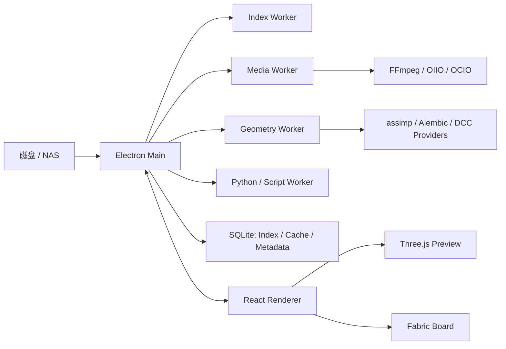
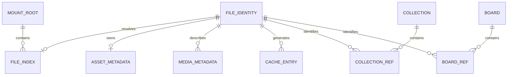

# RefCanvas 磁盘原生专业资产浏览与参考板方案

> 状态：方向锁定，等待按阶段实施  
> 基线：RefCanvas 0.37.2 / SQLite schema v13  
> 日期：2026-08-04

## 1. 最终定位

RefCanvas 不再沿用 Eagle 式“导入资料库”模型，最终定位为：

**磁盘原生文件管理器 + 专业媒体预览器 + Fabric 参考板。**

核心原则：

> 磁盘是唯一真相，SQLite 只保存可重建索引、缓存索引、用户 metadata 和引用关系。

```text
磁盘 / NAS
  -> 直接浏览
  -> 后台扫描、索引、metadata、thumbnail、waveform
  -> SQLite 索引与用户 metadata
  -> Collections / Boards 使用路径和 fingerprint 引用
```

用户挂载目录后立即按真实磁盘结构浏览，不再执行“导入”。给文件添加
tags、rating、notes 或加入 Collection 时，只建立索引和引用，不复制原文件。

## 2. 范围与明确排除项

### 2.1 纳入范围

- 多个本地磁盘、移动盘和 NAS mount roots。
- 完整文件浏览和文件操作。
- 本地 Collections，但只保存文件引用。
- tags、rating、notes 和格式相关 metadata。
- 图片、视频、音频、图片序列、HDR、3D、DCC、文档和字体预览。
- Found 可确认的本地高级功能和 Pro-style workflow。
- 多进程、typed provider 插件和统一资产模型。
- embedded Python、本地 Shell scripts 和自定义命令。
- Fabric 参考板及移动文件后的引用恢复。
- 本地 crash dump、诊断包、installer 和 signed updater。

### 2.2 明确排除

- 分享服务。
- 本地 HTTP 服务、QR 和密码访问。
- 任何监听端口或局域网文件暴露。
- 账号、会员、登录和 entitlement。
- 云同步、云存储和云端任务。
- 浏览器扩展及其下载目录。
- AI Design Refiner。
- PostgreSQL 和服务端数据库。
- Eagle managed storage。
- 多 Library、Library merge/export/registry。

Found 的 AI Design Refiner 会访问 `https://ai-api.aalab.com.cn/api`，并读取
token、检查会员状态和打开充值页面，属于已排除的账号和云服务，不保留空壳入口。

## 3. Found 入库方式结论

Found 主浏览区域表现为磁盘/NAS 原位浏览：

```text
文件系统
  -> 扫描和索引
  -> thumbnail 和 metadata
  -> 原文件保持原位
```

Collection 通过 `reference_target + filename` 一类的引用关系指向源文件，不等于
managed copy。浏览器扩展会先下载文件，但该入口已从 RefCanvas 范围中排除。

RefCanvas 的落地规则：

- 浏览文件不创建副本。
- 浏览文件允许按需创建或更新索引记录。
- 添加 metadata 不改变原文件内容。
- 添加到 Collection 只创建 `path + fingerprint` 引用。
- Board package 的显式导出可以按用户选择嵌入副本，但不能转化为内部 managed store。

## 4. 产品功能范围

| 模块 | 目标能力 |
| --- | --- |
| Mounts | 多根目录、盘符、移动盘、NAS、在线/离线状态、重连 |
| 导航 | 真实目录树、breadcrumb、后退/前进/上级、启动路径、快速访问 |
| 浏览 | Grid、detail、waterfall、排序、搜索、过滤、隐藏文件、格式白名单 |
| 文件操作 | 新建、重命名、复制、移动、粘贴、拖放、冲突处理、OS recycle bin |
| Collections | 本地层级集合、路径引用、批量加入和移除、缺失引用状态 |
| Metadata | tags、rating、notes、媒体 metadata、时间点 notes |
| 图片 | 常见图片、PSD/PSB、RAW、HEIF/AVIF、JXL、SVG |
| HDR | EXR/HDR、曝光、tone mapping、alpha background、OCIO、LUT |
| 视频 | 播放、scrubbing、逐帧、poster、codec、色彩和音轨信息 |
| 音频 | 播放、waveform、封面、codec、采样、声道、bit depth、BPM |
| 图片序列 | 自动分组、缺帧检测、播放、逐帧、FPS、转 MP4 |
| 3D | glTF/GLB/OBJ/FBX/STL/Alembic、动画、材质和几何统计 |
| DCC | PSD layers；Blend/Max/Maya/C4D 的 metadata、embedded preview 或本地 DCC provider |
| 文档 | PDF、Office、Markdown、文本的 thumbnail、metadata 或分页预览 |
| 字体 | TTF/OTF/WOFF/WOFF2 字样、family、style、weight、variable axes |
| Board | Fabric 参考板、poster 引用、缺失状态、自动重连、显式导出 |
| 扩展 | Typed resource providers、Python/Shell scripts、自定义命令 |

## 5. 总体架构

保留 Found 的多进程、插件化和资产管线骨架，不复制其 Qt、WebEngine、ZeroMQ
或私有实现。RefCanvas 继续使用 Electron、React、Fabric 和 Three.js。



### 5.1 进程职责

| 进程 | 职责 | 边界 |
| --- | --- | --- |
| `refcanvas-main` | mount、watcher、文件权限、SQLite、任务调度、IPC、Board 持久化 | 不执行重型媒体解析 |
| `refcanvas-renderer` | React UI、Three.js、Fabric 和预览交互 | 不直接访问文件系统或 native DLL |
| `refcanvas-index-worker` | 目录扫描、文件身份、索引、序列检测、搜索索引 | 不修改原始文件 |
| `refcanvas-media-worker` | probe、thumbnail、waveform、FFmpeg、OIIO、OCIO、convert | 崩溃不能影响 Main |
| `refcanvas-geometry-worker` | assimp、Alembic、FBX、几何统计、DCC provider | 不负责 UI 绘制 |
| `refcanvas-script-worker` | embedded Python、Shell scripts、自定义命令 | 不允许未信任脚本静默执行 |
| `refcanvas-crash-handler` | 本地 dump、worker 日志和诊断包 | 不自动上传 telemetry 或文件 |

不引入分享进程、账号进程和 PostgreSQL migration process。

### 5.2 IPC 和任务协议

Renderer 只能通过 `window.refCanvas` 调用能力。Main 与 worker 通过 Electron
`utilityProcess`、child process 或 named pipe 传递经过 Zod 校验的消息。

```ts
export interface WorkerJob {
  jobId: string;
  providerId: string;
  operation:
    | "probe"
    | "metadata"
    | "thumbnail"
    | "waveform"
    | "preview"
    | "convert";
  inputPath: string;
  options: Record<string, unknown>;
  deadlineMs: number;
}

export interface WorkerJobUpdate {
  jobId: string;
  state:
    | "queued"
    | "running"
    | "completed"
    | "cancelled"
    | "failed";
  progress: number;
  errorCode: string | null;
  error: string | null;
}
```

统一任务要求：

- job ID、provider ID 和 provider version 可追踪。
- 支持 bounded concurrency、进度、取消、deadline 和资源限制。
- 同一 cache key 的任务合并。
- worker 崩溃后由 Main 重启，最多自动重试一次。
- 单文件损坏只能使当前任务失败，不能阻塞目录或主窗口。
- Main 退出时按 script、geometry、media、index 顺序停止 worker。

## 6. Typed provider 插件系统

### 6.1 Provider contract

插件由 Main 的 registry 管理，Renderer 不加载任意第三方 DLL。

```ts
export type ProviderCapability =
  | "probe"
  | "metadata"
  | "thumbnail"
  | "waveform"
  | "preview"
  | "convert";

export interface ResourceProviderManifest {
  id: string;
  version: string;
  kinds: AssetKind[];
  extensions: string[];
  mimeTypes: string[];
  capabilities: ProviderCapability[];
  priority: number;
  runtime: "node" | "native-sidecar" | "external-cli";
}

export interface ResourceProvider {
  manifest: ResourceProviderManifest;
  health(): Promise<ProviderHealth>;
  probe(input: ProbeInput): Promise<ProbeResult>;
  metadata(input: MetadataInput): Promise<MetadataResult>;
  thumbnail(input: ThumbnailInput): Promise<ThumbnailResult>;
  preview(input: PreviewInput): Promise<PreviewResult>;
  convert(input: ConvertInput): Promise<ConvertResult>;
  dispose(): Promise<void>;
}
```

不支持的 capability 必须在 manifest 中缺省，不能通过运行后抛错伪装支持。

### 6.2 内置 providers

| Provider | 主要 runtime | 能力 |
| --- | --- | --- |
| `image-provider` | Sharp、OIIO、libraw、libheif、libjxl | 图片 probe、thumbnail、metadata、convert |
| `hdr-provider` | OpenEXR、OIIO、OCIO | EXR/HDR decode、thumbnail、色彩变换 |
| `video-provider` | FFmpeg/FFprobe | 视频 metadata、poster、逐帧、代理和转换 |
| `audio-provider` | FFmpeg | 音频 metadata、waveform、封面和播放代理 |
| `sequence-provider` | Index + FFmpeg | 序列识别、播放 manifest、缺帧、转 MP4 |
| `geometry-provider` | Three.js loaders、assimp、Alembic | 3D metadata、标准化场景和 preview source |
| `dcc-provider` | 已安装 DCC CLI 或专用 provider | proprietary DCC metadata 和 preview |
| `document-provider` | PDF renderer、Office provider | 文档 metadata、thumbnail、分页代理 |
| `font-provider` | FreeType/HarfBuzz | 字体 metadata、glyph 和样张 |
| `generic-provider` | Node/OS shell | 基础文件信息、系统 thumbnail 和 fallback |

### 6.3 Provider 选择和降级

1. 根据 extension、MIME 和 magic bytes 生成候选列表。
2. 过滤缺少 runtime 或 health check 失败的 provider。
3. 按 capability、priority 和 fidelity 选择。
4. 主 provider 失败时转入已声明的 fallback。
5. 记录最终 provider、版本、耗时和错误码。
6. 所有 provider 都失败时显示明确占位和“使用系统打开”。

依赖存在只能证明 provider 候选可用，不能直接宣称格式完整支持。每个格式必须有
fixture、metadata assertion 和 preview smoke 才能进入支持矩阵。

### 6.4 Python 和 Shell 命令插件

命令插件与 native provider 不共用 ABI，manifest 包含：

- name、author、description、version。
- extension/MIME filters。
- `browser` 或 `preview` entry point。
- command、parameters 和 working directory。
- timeout、输出类型和是否修改文件。

首次执行必须展示实际 command 和参数并请求信任。信任按脚本内容 hash 保存；
脚本变化后重新确认。该机制不是安全 sandbox，不运行来源不明的脚本。

## 7. 资产模型

### 7.1 模型原则

- 文件记录不代表 RefCanvas 拥有文件。
- `absolute path` 由 mount root 和 relative path 解析。
- file index、media metadata 和 thumbnail cache 均可重建。
- tags、rating、notes 是不可重建用户数据，必须参与数据库备份。
- Collection 和 Board 使用 path 与 fingerprint 双重引用。
- mount 离线与文件删除是不同状态。



### 7.2 核心实体

```ts
export interface MountRoot {
  id: string;
  path: string;
  displayName: string;
  volumeId: string | null;
  state: "online" | "offline" | "permission-denied";
  lastSeenAt: string | null;
}

export interface FileIdentity {
  id: string;
  mountId: string;
  relativePath: string;
  fileId: string | null;
  size: number;
  mtimeMs: number;
  quickHash: string | null;
  contentHash: string | null;
  linkState: "online" | "missing" | "offline" | "ambiguous";
}

export interface IndexedAsset {
  identityId: string;
  kind: AssetKind;
  extension: string;
  metadataStatus: "pending" | "ready" | "failed";
  indexedAt: string;
}

export interface UserAssetMetadata {
  identityId: string;
  tags: string[];
  rating: number;
  notes: string;
  updatedAt: string;
}

export interface CollectionReference {
  id: string;
  collectionId: string;
  mountId: string;
  relativePath: string;
  fingerprint: string;
  state: "resolved" | "missing" | "ambiguous" | "offline";
}

export interface BoardAssetReference {
  mountId: string;
  relativePath: string;
  fingerprint: string;
  lastResolvedPath: string;
}
```

用户 metadata 核心字段只保留 tags、rating、notes。BPM、codec、dimensions、
color space 等属于提取出来的媒体 metadata，不属于用户自定义字段。

### 7.3 SQLite 表

| 表 | 内容 | 是否可重建 |
| --- | --- | --- |
| `mount_roots` | 挂载根和状态 | 否 |
| `file_identities` | 路径、file ID、fingerprint、link state | 部分 |
| `file_index` | kind、extension、size、mtime、索引状态 | 是 |
| `asset_metadata` | tags、rating、notes | 否 |
| `media_metadata` | 格式专属 metadata JSON | 是 |
| `cache_entries` | thumbnail、poster、waveform、proxy 地址 | 是 |
| `collections` | 本地虚拟集合树 | 否 |
| `collection_refs` | Collection 文件引用 | 否 |
| `boards` | Board documents | 否 |
| `tasks` | 可恢复后台任务 | 是 |
| `settings` | 本地偏好和 provider 配置 | 否 |

不再存在：

- `storage_mode`。
- `library_relative_path`。
- `original_source_path`。
- managed `files/` store。
- `collection_sources`。
- Library registry。

### 7.4 Fingerprint 和重连

Windows 本地磁盘优先使用：

```text
volume serial + file ID
```

NAS、移动盘和 file ID 不稳定的文件系统使用：

```text
size + mtime + quick hash
```

只有发生移动、冲突或歧义时才计算 full SHA-256。重连顺序：

1. 原路径仍存在且 fingerprint 匹配。
2. 同一 mount 中 file ID 匹配。
3. 同一 mount 中 quick fingerprint 唯一匹配。
4. full SHA-256 唯一匹配。
5. 多个候选时标记 `ambiguous` 并要求用户选择。

### 7.5 状态语义

- 应用内 rename/move：事务性更新磁盘路径、identity、Collection 和 Board 引用。
- 外部 rename/move：watcher 尝试按 identity 重连。
- 外部删除：清除 file index、media cache 和 Collection reference。
- Board 引用不静默删除，显示 missing placeholder。
- mount 离线：所有子项标记 `offline`，不能执行批量清理。
- mount 恢复：执行增量 reconcile，再处理真正缺失的文件。

## 8. 磁盘文件管理

### 8.1 文件夹树

- 左侧树只显示 mount roots 下的真实目录。
- 目录增删改直接来自磁盘和 watcher。
- Folder flattening 是查询视图，不创建、移动或删除文件夹。
- Collections 在单独区域显示，不能伪装成磁盘目录。

### 8.2 文件操作

- New Folder。
- Rename。
- Copy、Cut、Paste。
- 同目录和跨目录 drag-and-drop。
- 跨卷 move 使用 copy、校验、再移入回收站的流程。
- 文件名冲突支持 skip、rename、replace 和 apply to all。
- 删除默认调用 OS recycle bin，不提供默认永久删除按钮。
- 所有破坏性操作在 Main 中重新验证 canonical path、mount scope 和 scan revision。
- symlink/junction 不得逃逸出用户允许的 mount scope。

### 8.3 删除语义

| 操作 | 磁盘文件 | Collection | Board |
| --- | --- | --- | --- |
| 从 Collection 移除 | 保留 | 删除引用 | 不变 |
| 移到回收站 | 进入 OS recycle bin | 删除引用 | missing placeholder |
| 外部删除 | 已不存在 | watcher 清理引用 | missing placeholder |
| mount 离线 | 不确定 | 保留并标记 offline | 保留并标记 offline |

## 9. 格式和媒体管线

| 类型 | 格式 | Preview | Metadata / Inspector | 主要 provider |
| --- | --- | --- | --- | --- |
| 常见图片 | JPG/PNG/WebP/GIF/BMP/TIFF/TGA/SVG/AVIF | 原图、动画、缩放 | 尺寸、通道、bit depth、ICC、EXIF | image |
| Photoshop | PSD/PSB | composite、layer thumbnail | layer tree、颜色模式、画布 | image/DCC |
| RAW | 常见相机 RAW | developed proxy | 相机、镜头、曝光、white balance | image |
| HDR | EXR/HDR | WebGL tone mapping | channels、compression、chromaticities | HDR |
| 视频 | MP4/MOV/MKV/WebM/AVI | 播放、scrub、逐帧 | codec、pixel format、色彩、音轨 | video |
| 音频 | WAV/MP3/FLAC/OGG/M4A | 播放、waveform | codec、sample rate、channels、BPM | audio |
| 序列 | `name.####.ext` 等 | 单项播放、逐帧 | frame range、gaps、FPS | sequence |
| 标准 3D | GLTF/GLB/OBJ/FBX/STL | Three.js interactive | vertex、triangle、UV、bbox、材质 | geometry |
| Alembic | ABC | geometry/animation | samples、time range、objects | geometry |
| DCC | BLEND/MAX/MA/MB/C4D | embedded preview 或 provider proxy | scene metadata | DCC |
| 文档 | PDF/Office/Markdown/Text | 分页或转换代理 | pages、author、title、fonts | document |
| 字体 | TTF/OTF/WOFF/WOFF2 | 自定义样张 | family、style、axes、glyph count | font |

专有 DCC 的完整场景解析不能仅凭扩展名承诺。没有对应 DCC 或合法 SDK 时，必须
降级为 embedded thumbnail、metadata 和系统打开。

### 9.1 3D inspector

- vertex 和 triangle count。
- mesh、node、material 和 texture count。
- UV sets、normal、tangent 和 vertex color。
- bounding box、尺寸、单位和 up axis。
- animations、duration、cameras 和 lights。
- 缺失外部 texture 列表。
- wireframe、normal、grid、environment 和 animation controls。

Three.js 场景保持 full-bleed，不放入装饰性 card。模型解析失败不能产生空白 canvas；
必须显示错误状态和系统打开入口。

### 9.2 EXR/HDR

- 使用 Three.js `EXRLoader`、`RGBELoader` 或 worker 生成的代理。
- Linear workflow 和明确的 display transform。
- exposure、tone mapping 和 alpha background。
- 显示 channel、compression、data window、display window 和 chromaticities。
- cache key 包含源 fingerprint、provider version、OCIO config 和 preview variant。

### 9.3 视频和音频

- 视频 frame step 必须通过准确时间戳或 FFmpeg frame extraction，不依赖不精确的
  HTML video seek。
- Inspector 显示 codec、profile、level、resolution、frame rate、duration、
  time base、pixel format、bit depth、primaries、transfer、matrix 和 audio tracks。
- 音频显示 waveform、duration、codec、sample rate、channels、bit depth、bitrate、
  cover art 和 BPM。
- 支持时间点 notes。

### 9.4 图片序列

- Grid 中同一序列只显示一个条目。
- `standard`：点或下划线分隔、至少 4 位 frame number。
- `compatible`：允许一致数字宽度的常见命名。
- `custom`：用户 regex，保存前提供测试结果。
- 显示 start、end、count、missing frames 和 resolution。
- 默认 24 FPS，允许 `0.01-240 FPS` presets。
- 用户可展开查看实际帧。
- 删除序列必须明确显示将进入回收站的文件数量。

Sequence -> MP4 支持最多三个 presets：

- H.264 或 H.265。
- medium、high、best。
- original、half、quarter resolution。
- 输出冲突确认和任务取消。

## 10. Found 高级和 Pro-style 功能

Found 设置资源中 `pro-options` 和使用 `pro.svg` 的色彩管理可以确认以下本地能力。
`tabs.pro` 的中文实际为“选项”，因此本方案不把它解释为商业订阅边界。

### 10.1 高级浏览

- Folder flattening：1、2 或自定义深度。
- 每个文件夹独立记忆 flattening 设置。
- 高深度和大量目录时显示性能警告。
- 文件夹 single-click/double-click 行为。
- 显示隐藏文件。
- 启动路径和记住上次路径。
- 格式过滤标签和非视觉格式白名单。

### 10.2 高级预览

- 视频、图片序列和动画 3D 独立 autoplay 设置。
- 图片序列 FPS presets。
- alpha background：black、white、checker 和 custom。
- UI scaling。
- worker threads 和 memory limit。

### 10.3 色彩管理

- 自动检测 `$OCIO`。
- 内置经过 redistribution 审查的 Studio Config。
- 注册额外 OCIO configs。
- Camera LUT：log 到 sRGB/Rec.709。
- Look LUT：display-referred creative look。
- LUT 文件和目录管理。
- 当前 OCIO config、display、view、look 和 LUT 必须进入 cache key。

### 10.4 输出工作流

Downscale image 支持：

- 文件名追加分辨率，例如 `image_2k.png`。
- 输出到分辨率子目录。
- 保持原名并备份原文件。

第三种模式会修改原路径，执行前必须展示源、备份和输出路径，并处理冲突。

### 10.5 本地设置

- 关闭到系统托盘或完全退出。
- 自动更新。
- 系统代理只用于 signed update 请求，不承载账号或素材服务。
- debug logging。
- `zh-CN`、`zh-TW`、`en`、`ja`、`ko`、`es`、`fr` 本地化目标。

## 11. Fabric Board V4

Board document 从 asset ID 引用迁移为：

```ts
export interface BoardAssetReferenceV4 {
  mountId: string;
  relativePath: string;
  fingerprint: string;
  lastResolvedPath: string;
  posterCacheKey: string | null;
}
```

行为要求：

- Board 打开时批量解析引用，不能逐对象同步访问磁盘。
- 路径变化但 fingerprint 匹配时自动更新引用。
- 多候选时不自动选择，显示 relink UI。
- 文件缺失时保留对象位置、尺寸、变换、notes 和 poster。
- 3D、视频、序列和 HDR 放入 Board 时默认使用 poster/reference，不要求 Fabric
  内运行完整 Three.js scene。
- 双击 Board 对象进入对应格式的完整 preview。
- JSON、PNG/JPEG/WebP 和显式 package export 保留。
- package export 嵌入副本是用户触发的交付动作，不得重新引入 managed library。

## 12. UI 信息架构

主界面保持高密度生产工具布局：

```text
左侧：Mounts / Collections / Boards
中间：真实目录 Grid / Detail / Preview
右侧：按格式变化的 Inspector
底部：可折叠 Task Center
```

| Before | After |
| --- | --- |
| Library 和 Import 入口 | Mounts、Collections、Boards |
| Collection 冒充磁盘文件夹 | 磁盘树与虚拟 Collection 分区 |
| 文件序列逐帧占满 Grid | 单个 Sequence item |
| 通用 DetailsPanel | Image/Video/Audio/Sequence/3D/Document inspectors |
| 重型任务阻塞 Renderer | 后台 job、进度、取消和失败状态 |
| Board 只依赖 asset ID | path、fingerprint、missing 和 relink |

交互标准：

- 工具按钮使用 Lucide icon 和 tooltip。
- 最小 hit area 为 `40x40`。
- press 状态使用 `scale(0.96)`。
- 表格、时间码、frame 和文件大小使用 tabular numbers。
- thumbnail 使用约 10% pure-white inset outline 保证明暗图边界。
- 不使用 `transition: all`。
- 不增加 motion dependency。
- 固定格式控件使用稳定尺寸，动态内容不得推动 toolbar。
- 不使用营销式 hero、装饰性漂浮 cards 或 nested cards。
- Preview、empty、loading、offline、missing、ambiguous、failed 都有完整状态。

## 13. Migration v14

### 13.1 阶段 0：先改变行为

- 文件夹树改读真实磁盘目录。
- 停止导入时镜像创建 Collection。
- 停止调用 `markCollectionSource`、backfill 和
  `pruneEmptyGeneratedCollections`。
- 删除磁盘文件夹后由 watcher 更新树。
- 不立即删除旧表，先验证新行为。

### 13.2 v14 schema

- 升级前创建 SQLite snapshot 和 migration manifest。
- 删除 `collection_sources`。
- Collections 改为 `collection_refs`。
- 引入 mount、identity、cache 和 provider metadata 表。
- 删除 managed storage 字段和接口。
- 删除多 Library registry。
- Board document 升级为 schema V4。

### 13.3 Managed preflight

禁止静默删除 managed 文件：

1. 统计 managed records 和实际文件。
2. 如果为零，允许直接迁移。
3. 如果非零，要求选择普通磁盘目标目录。
4. 将文件复制或移动到该目录。
5. 逐文件验证 size 和 SHA-256。
6. 将目标目录注册为 mount root。
7. 更新 path 和 fingerprint。
8. 全部成功后才允许移除 managed store。

当前已核验数据为 0 assets、0 managed 和 0 Collection memberships，当前用户数据
执行该迁移的风险较低，但实现仍必须覆盖非零数据。

### 13.4 API 清理

删除：

- `ImportOptions`、`ImportResult`、`MaterializeOptions`。
- `AssetStorageMode` 和 `library-default`。
- `libraries.merge`、`libraries.exportLibrary` 和 registry API。
- managed verify 和 managed cleanup。

新增：

- `mounts.add/remove/list/reconnect`。
- `filesystem.createFolder/rename/copy/move/trash`。
- `metadata.ensure/patch`。
- `collections.addReferences/removeReferences`。
- `media.probe/thumbnail/preview/convert/cancel`。
- `providers.list/health`。
- `boards.resolveReferences/relinkReference`。

## 14. 实施阶段

### 阶段 0：语义和安全基线

- 锁定磁盘唯一真相。
- 移除 UI 中“导入资料库”的行为和文案。
- 分离“移出 Collection”和“移到回收站”。

验收：所有浏览和 metadata 操作都不复制源文件。

### 阶段 1：架构骨架

- `MountRoot`、`FileIdentity` 和 worker protocol。
- Worker supervisor 和 typed provider registry。
- Index worker 与真实目录树。
- Worker crash、cancel 和 timeout 测试。

验收：损坏文件或 worker crash 不阻塞主窗口。

### 阶段 2：文件管理和 migration v14

- 完整文件操作。
- Mount offline/reconnect。
- Collection references。
- 退役 managed storage 和多 Library。

验收：外部增删改、跨卷移动和离线恢复符合状态语义。

### 阶段 3：本期必须交付的媒体能力

- 3D。
- EXR/HDR。
- 视频逐帧和完整 metadata。
- 图片序列分组、播放和 Inspector。

验收：每类格式通过 fixture、thumbnail、metadata 和 preview smoke。

### 阶段 4：专业格式

- 音频 waveform。
- PSD/PSB、RAW、HEIF、JXL。
- Alembic、DCC providers。
- PDF、Office 和 fonts。

验收：缺少 proprietary runtime 时有明确降级，不显示虚假支持。

### 阶段 5：Found 高级功能

- Sequence rules、FPS presets 和 MP4 presets。
- Folder flattening。
- Alpha preview。
- Downscale naming。
- OCIO 和 LUT。
- Python/Shell scripts。
- Performance 和 autoplay preferences。

验收：所有设置进入持久化、cache invalidation 和任务参数。

### 阶段 6：Board V4

- path + fingerprint 引用。
- 自动重连、歧义处理和 missing placeholder。
- 验证 `BoardCanvas` 和独立 Board window。

验收：移动文件后 Board 自动恢复；删除文件不破坏 Board document。

### 阶段 7：发布

- Signed installer 和 updater。
- Runtime packaging。
- Local crash dump。
- License manifest。
- Clean Windows VM smoke。

## 15. 测试和发布验收

### 15.1 自动化测试

- v13 -> v14 migration、失败 rollback 和 snapshot restore。
- mount online/offline/permission-denied。
- watcher add/change/unlink/rename 和丢事件 reconcile。
- symlink/junction scope escape。
- copy/move/trash 和文件名冲突。
- standard/compatible/custom sequence detection。
- missing frames、不同 frame width 和错误 regex。
- provider selection、fallback、timeout、cancel 和 crash restart。
- 每类格式的 probe、metadata 和 thumbnail fixtures。
- EXR/HDR 已知色彩转换结果。
- 视频 frame-step 和 timecode。
- Board V4 自动重连、missing 和 ambiguous。
- 脚本信任 hash、变更后重新确认和 timeout。

### 15.2 性能验收

- 目录先显示文件名，再异步补齐 metadata 和 thumbnail。
- 大目录扫描不得阻塞 Renderer。
- 并发数和内存限制实际生效。
- Grid 滚动期间不得因 metadata 更新改变 tile 尺寸。
- 相同 preview 请求合并。
- cache 使用 fingerprint、provider version、variant 和 color config 作为键。
- release capacity test 保持 500k 索引基线。

### 15.3 最终发布条件

- Renderer、IPC 和 UI 中不存在 managed storage 和“导入资料库”。
- SQLite 删除后仍能重新浏览全部磁盘文件。
- mount 离线不会触发批量删除。
- 3D、EXR/HDR、视频、音频和序列 worker 失败不会带崩应用。
- Board 引用可以自动重连。
- 没有监听端口、分享服务、账号请求和自动 telemetry。
- Packaged runtime 在干净 Windows 环境中不依赖开发机 PATH。
- 每个 bundled native component 都进入第三方 license manifest。

## 16. Packaging 和 License Gate

| 组件 | 风险 | 要求 |
| --- | --- | --- |
| FFmpeg | x264/x265 可能触发 GPL | 发布前确定 LGPL/system encoder、商业授权或 GPL 合规方案 |
| OpenImageIO/OCIO/OpenEXR | 第三方依赖链 | 固定版本并生成 notices |
| assimp/Alembic | 格式 fidelity | fixture 验证后再宣称支持 |
| FBX SDK | Autodesk proprietary license | 只有取得合法 redistribution 权限才捆绑 |
| CUDA | NVIDIA redistribution 和体积 | 可选 provider，必须有 CPU fallback |
| Python | runtime 和 wheels license | 固定 runtime，清点所有 wheels |
| RAW/HEIF/JXL | codec patent/license 差异 | 按发行地区审查 |
| Office provider | 体积和 redistribution | 独立评估，不静默依赖本机软件 |

如果完整捆绑 Found 级 native runtime，Windows 离线安装包预计会显著增大。包体大小
不能通过运行时静默下载来隐藏；是否拆分 media pack 必须作为发布决策单独确认。

## 17. 当前基线

截至 2026-08-04：

- Git worktree 干净。
- `pnpm check` 通过：66 test files、364 tests。
- SQLite schema 为 v13。
- 当前数据为 0 assets、0 managed、0 Collection memberships。
- 当前存在 1 个 watch root 和 1 个 Board。
- Electron、React、Fabric、Three.js、FFprobe、Sharp 和 SQLite 已存在。

该基线说明当前是完成架构切换的低风险窗口，但不降低 migration、backup 和
non-zero managed data 测试要求。

## 18. 依据

- `C:\Users\lin10\Desktop\OH-WorkSpace\found_probe\Found_3.5.122_逆向分析报告.md`
- `C:\Users\lin10\Desktop\OH-WorkSpace\found_probe\7z_out\extracted\bin\settings\locales\zh-CN\translation.json`
- `docs/research/found-3.5.122.md`
- `docs/architecture/overview.md`
- `src/main/persistence/repositories/migration-repository.ts`
- `src/shared/contracts.ts`

