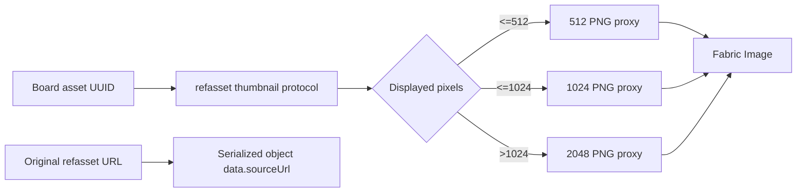

# PureRef 2.1.3 clean-room 白板交互对照

## 1. 范围与边界

本报告只使用 PureRef 官方 Handbook 2.1、默认快捷键页面和合成图片上的公开可观察交互。没有反编译 `PureRef-2.1.3_x64.exe`，没有读取、提取或复用其程序资源、私有代码、协议和文件格式。

公开资料：

- [Navigation](https://www.pureref.com/handbook/navigation/)
- [Default shortcuts](https://www.pureref.com/handbook/shortcuts/all-shortcuts)
- [Images](https://www.pureref.com/handbook/images/)
- [Canvas](https://www.pureref.com/handbook/canvas/)

## 2. 可确认的交互行为

| 行为 | 官方资料 | RefCanvas 0.37.0 |
| --- | --- | --- |
| 左键移动对象 | `Move item: Left MB` | 保持 |
| `Ctrl + 左拖` 旋转 | `Rotate: Left MB + Ctrl` | 指针下对象可直接旋转，无需预选 |
| `Ctrl + Shift + 左拖` 吸附旋转 | `Snapped rotate: Left MB + Ctrl+Shift` | 吸附到最近 `45°` |
| `Ctrl + Alt + 左拖` 缩放 | `Scale: Left MB + Ctrl+Alt` | 保持 |
| `Ctrl + Alt + Shift + 左拖` 透明度 | `Change opacity` | 保持 |
| `Alt + 左拖` 或中键平移 | Handbook `Pan` | 保持 |
| `Z + 左拖` 连续缩放 | Handbook `Zoom` | 保持 |
| 右键菜单 | Handbook `Right click menu` | 空白、单对象、图片和多选均有上下文菜单 |
| 命令面板 | `Ctrl + Shift + P` | 保持，并允许菜单滚动 |
| `Escape` 取消 | `Cancel progress / Clear selection` | 活动旋转恢复手势前角度，不写 history/save |

## 3. 选择与旋转差距

此前 RefCanvas 使用 Fabric 默认实心控制点和顶部旋转柄。旋转必须先选中对象，过程中会丢失选框；在低缩放和高 DPI 下，控制点视觉尺寸和命中区域也不稳定。

0.37.0 改为：

- `1 CSS px` selection border。
- 四个 `8px` 空心角标，鼠标命中区 `20x20px`、触摸命中区 `28x28px`。
- 去掉顶部旋转柄，在四个角点外侧设置独立、不可见的旋转命中区。
- `Ctrl + 左拖` 直接命中图片；命中已有 `ActiveSelection` 成员时旋转整个 selection。
- 旋转时保留 selection 和 signed-angle HUD。
- 角度计算始终基于手势起点，跨越 `+/-180°` 不累积跳变。
- `Escape` 恢复 base angle；正常松手只产生一条历史记录和一次 debounced save。

## 4. 渲染与资源管线

- 白板代理只接受 `512/1024/2048` 三种尺寸，URL 只包含 asset UUID。
- cache identity 包含 canonical path、size、mtime 和 proxy variant；源文件变化后失效。
- Sharp conversion 继续在 utility process 内运行，主进程验证 cache output path。
- 新放入的静态图片先加载低成本代理；停止缩放后只升级屏幕内图片。
- GIF 保持原始流，避免代理破坏帧动画。
- pan、zoom、rotate、scale、crop 和 HUD render 通过 rAF 合并。
- history snapshot 从 pointer event stack 移到单个 rAF commit；同帧 Fabric events 合并，保存仍为动作后的 debounce，不增加周期备份。
- 批量放入白板关闭逐对象 render/history/save，8 项并发加载，最后只 render/save 一次。
- Layers 使用 `44px` 固定行高窗口化，只渲染视口与 overscan。

## 5. 兼容与安全

- `BoardDocumentV3` 不变；新增代理信息放在 Fabric object 的可选 `data` 字段。
- 旧白板仍可直接加载，首次可见时按需换成代理。
- board proxy URL 不包含绝对路径，不增加 renderer IPC。
- 不修改素材数据库，不修改源图片，不增加自动备份。

## 6. 验收矩阵

| 项目 | 自动验证 |
| --- | --- |
| 角点与外侧旋转区 | `board-controls.test.ts` |
| 角度跨界、45 度吸附、取消恢复 | `board-gestures.test.ts` |
| 512/1024/2048 选择与安全 URL | `board-proxy.test.ts` |
| proxy cache identity | `preview-cache-key.test.ts` |
| 2,000 对象 pan/zoom | packaged `fps-check.cjs` |
| 数据与协议兼容 | full Vitest + packaged runtime smoke |

## 7. 实现取舍

0.37.0 保留现有完整 canvas snapshot 的 undo 语义，但把序列化延后并按帧合并。没有用不完整的 object-only history 替换结构化快照，因为新增、删除、分组、父子层级和 GIF 状态必须在同一撤销事务中恢复；缺少完整 transaction model 时局部 action record 会造成数据不一致。
