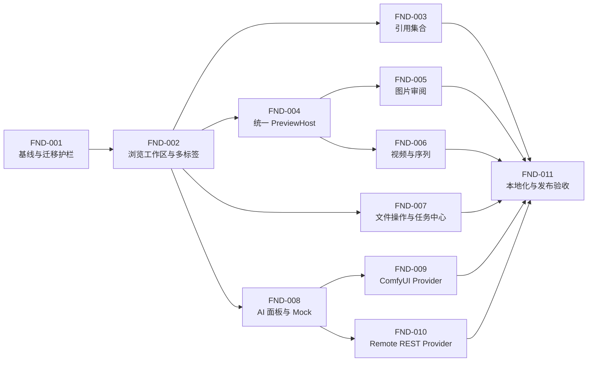

# RefCanvas 0.38.0 — Found Clone 垂直切片 Tickets

> 来源规格：[found-clone.md](./found-clone.md)  
> Found 分析基线：[found-analysis README](../../gpt-5.6-instruct/found-analysis/README.md) / [证据索引](../../gpt-5.6-instruct/found-analysis/EVIDENCE_INDEX.md) / [功能矩阵](../../gpt-5.6-instruct/found-analysis/FUNCTION_MATRIX.md)  
> 目标版本：`0.38.0` / schema `17`  
> 拆分原则：每个 ticket 交付一个可独立演示、可自动验证的用户结果；不得再按数据库、IPC、Renderer 等技术层横向拆票。

<a id="dependency-graph"></a>
## 依赖图



| Ticket | 前置依赖 | 直接阻塞 | 可并行说明 |
| --- | --- | --- | --- |
| [FND-001](#fnd-001) | 无 | FND-002 | 必须最先完成 |
| [FND-002](#fnd-002) | FND-001 | FND-003、004、007、008 | 完成后开启四条工作流 |
| [FND-003](#fnd-003) | FND-002 | FND-011 | 可与预览、文件、AI 线并行 |
| [FND-004](#fnd-004) | FND-002 | FND-005、006 | PreviewHost 合并后图片和动态媒体可并行 |
| [FND-005](#fnd-005) | FND-004 | FND-011 | 可与 FND-006 并行 |
| [FND-006](#fnd-006) | FND-004 | FND-011 | 可与 FND-005 并行 |
| [FND-007](#fnd-007) | FND-002 | FND-011 | 可独立并行 |
| [FND-008](#fnd-008) | FND-002 | FND-009、010 | AI Provider 基线 |
| [FND-009](#fnd-009) | FND-008 | FND-011 | 可与 FND-010 并行 |
| [FND-010](#fnd-010) | FND-008 | FND-011 | 可与 FND-009 并行 |
| [FND-011](#fnd-011) | FND-003、005、006、007、009、010 | 无 | 最终集成与发布门禁 |

## 推荐实施顺序

1. 串行完成 FND-001、FND-002。
2. 并行启动：FND-003；FND-004→FND-005/FND-006；FND-007；FND-008→FND-009/FND-010。
3. 所有汇聚 ticket 通过后执行 FND-011。

## 全局完成定义

每个 ticket 除自身标准外，还必须满足：

- 交付结果可从打包前的 Electron 应用中独立演示，不依赖仅存在于测试中的调用路径。
- 新增 IPC 输入使用共享 Zod schema；Renderer 不直接访问文件系统、密钥、子进程或 Provider 网络。
- 异步订阅提供取消订阅函数；组件卸载、标签关闭或请求过期后不再写回 UI。
- 新增 UI 文案使用 i18n key；FND-011 前至少提供英文和简体中文值，缺失时回退英文。
- 成功、失败、取消路径均释放临时文件、对象 URL、worker、监听器和计时器。
- 不修改 Found 私有资源/协议，不删除 Board，不把用户文件移动到托管库，不静默覆盖输出。
- ticket 中列出的自动化命令全部通过，且不得用 `.skip`、扩大为全局超时或删除断言规避失败。
- 每个 ticket 关闭时附“Found 证据 → RefCanvas 实现 → 自动化结果/验收截图”；没有 Found 动态证据的能力必须标为 RefCanvas 扩展。
- 实现者只使用规格允许的报告、截图、UI 树、快照和自生成 fixture；不得复制 `ida/extracted-ui`、反编译 C/ASM、IDB、二进制样本或 Found 私有协议。
- RefCanvas 截图按 `out/qa/found-clone/<ticket-id>/` 保存，文件名包含场景和窗口尺寸；该目录属于验收产物，不作为运行时依赖。

关闭 ticket 时附以下记录，字段不得省略：

```md
### 验收证据
- Found 依据：<相对链接；无动态证据时写“RefCanvas 扩展”>
- RefCanvas 构建：<commit 或工作区标识>
- 自动化：<命令、退出码、报告路径>
- 成功路径：<步骤、结果、截图路径>
- 失败/恢复路径：<步骤、结果、截图或日志路径>
- 范围核对：<未引入 Found 私有资源/协议；排除项未实现>
```

---

<a id="fnd-001"></a>
## FND-001 — 稳定测试基线与 schema 17 迁移护栏

**用户价值**  
现有用户升级后可以安全打开数据库；迁移失败时保留原库和可恢复备份，而不是带着部分结构继续启动。

**依赖**：无  
**阻塞**：FND-002

**Found 分析依据**：磁盘原生与集合数据模型见 [REPORT.md](../../gpt-5.6-instruct/found-analysis/REPORT.md)，原件/回滚要求见 [VERIFICATION.md](../../gpt-5.6-instruct/found-analysis/VERIFICATION.md)。schema 17 与安全迁移属于 RefCanvas 自有兼容要求，不复制 Found 数据库 SQL。

### 范围

- 修复当前两个已知基线问题：MP4 测试只核对本次测试创建的临时目录；HEIC 首次 Sharp 加载使用预热或该用例的定向超时。
- 把数据库目标版本设为 17，并一次性建立 `collections`、`collection_items`、`ai_jobs` 及规格要求的索引/约束，避免后续 ticket 改写已执行的同版本迁移。
- 修订尚未执行的 v16：非空旧集合表改名归档，空表可以退休；不得无条件删除非空集合数据。
- v17 实现归档/迁移前快照导入、计数校验、事务回滚、幂等运行和可诊断失败。
- 复用现有迁移备份机制；Settings 中现有数据库信息能显示 schema 17，失败启动页能给出备份位置与恢复操作说明。
- 为后续 ticket 提供空仓储接口所需的表结构，但本 ticket 不注册集合或 AI 产品 API。

### 明确排除

- 不实现集合 CRUD、集合 UI、AI Provider 或 AI 面板。
- 不试图凭空恢复已经被旧版 v16 删除且没有归档/备份的数据。
- 不清理用户机器上不属于当前测试或迁移任务的全局临时目录。

### 实现约束

- `user_version` 只在整个 v17 事务与校验成功后写入 17。
- 归档导入必须保留集合层级、排序和可恢复引用；无法映射的行保留在归档中并中止迁移。
- `collection_items` 不以 `assets.id` 作为级联存活外键；`ai_jobs` 不保存密钥或二进制。
- 已经是 17 的数据库再次启动不得重复导入或创建重复行。

### 完成标准

- [ ] 完整 `pnpm check` 连续运行两次均通过；预先放置无关的 `refcanvas-mp4-*` 临时目录不会令 MP4 测试失败。
- [ ] HEIC 用例在完整并行测试中稳定通过，且没有提高 Vitest 全局超时。
- [ ] schema 13、15、16 的非空 fixture 升级后 `user_version = 17`，集合/条目计数及非空路径计数与迁移前一致。
- [ ] 模拟导入计数不一致时，所有 v17 DDL/DML 回滚、`user_version` 不前进，原数据库和备份均可再次打开。
- [ ] 已由旧构建升到破坏性 v16且无归档的 fixture 能启动为空集合 schema，并返回一次性、事实准确的恢复说明。
- [ ] 同一数据库重复执行迁移入口不会增加集合、条目、AI job 或归档行。
- [ ] 应用启动后的 Settings 显示 schema 17；迁移失败时不进入主工作区。

### 自动化验证

```powershell
pnpm vitest run tests/unit/main/mp4-export.test.ts tests/unit/main/professional-formats.test.ts
pnpm vitest run tests/unit/main/migration.test.ts tests/unit/main/hardening.test.ts tests/unit/main/database.test.ts
pnpm typecheck
pnpm check
```

### 人工验证

使用 v15 非空集合数据库副本启动应用，确认升级完成；再用故意破坏的归档副本启动，确认应用停止在可恢复错误页且原文件未变化。

---

<a id="fnd-002"></a>
## FND-002 — 浏览器工作区、多标签与单实例路径导航

**用户价值**  
用户可以同时打开多个目录，在标签间切换而不丢失搜索、筛选、历史、选择和滚动位置；再次从系统打开路径时复用现有窗口。

**依赖**：FND-001  
**阻塞**：FND-003、FND-004、FND-007、FND-008

**Found 分析依据**：[主窗口与 UI 树](../../gpt-5.6-instruct/found-analysis/artifacts/02-main-window.png)、[实时监听](../../gpt-5.6-instruct/found-analysis/artifacts/07-live-file-watcher.png)、[文件夹/快速访问菜单](../../gpt-5.6-instruct/found-analysis/artifacts/12-folder-context-menu.png)、[类型筛选](../../gpt-5.6-instruct/found-analysis/artifacts/16-video-type-filter.png)，以及功能矩阵“启动、窗口与导航”。

### 范围

- 将顶层工作区固定为 Browser/Board，两者切换时保留各自状态。
- 实现规格中的 `BrowserTabState` 与 `NavigationStateV3`，迁移现有 Navigation V2 为一个 directory tab。
- 实现目录标签的新建、关闭、重排、切换、前进、后退、面包屑导航和“在新标签打开”。
- 每个标签独立保存目录、历史、查询、类型筛选、展平深度、网格尺寸、选中项和滚动位置。
- Main 处理 single-instance/open-file/open-directory 事件；第二实例路径聚焦现有窗口并按规格打开新标签。
- 左栏提供快速访问、挂载点、Collections 占位分组和 Boards；快速访问支持显示名、重排和安全移除。
- General/Formats 设置交付启动目录、记住路径、单击/双击目录、隐藏/点/系统文件、UI 缩放、Preview/AI 页签显隐、自定义类型筛选、序列识别模式和自定义正则。
- 建立内部 i18n runtime 和 `en`/`zh-CN` 基础 catalog；本 ticket 新 UI 全部使用消息 key。

### 明确排除

- Collections 分组只显示空状态，不实现集合 CRUD。
- 右侧只保留现有详情/预览占位，不实现统一 PreviewHost 或 AI 面板。
- 不改变 Board 文档 schema、画布交互或 Board 数据模型。

### 实现约束

- 标签 id 是稳定 UUID；目录 target 使用 Main 规范化后的绝对路径。
- 每个标签拥有独立请求代次和取消函数；只有 id 与代次同时匹配的响应能更新标签。
- durable navigation 写入失败只显示非阻断通知，不清空内存状态；损坏 JSON 回退默认标签并保留诊断日志。
- 最后一个标签关闭后立即创建一个空目录标签，不显示无导航出口的空壳。

### 完成标准

- [ ] 用户可打开三个目录标签，各自设置不同搜索、筛选、展平、网格尺寸和滚动位置；往返切换后状态不串联。
- [ ] 关闭正在搜索的标签会取消 Main/worker 请求；随后到达的旧结果不会出现在活动标签。
- [ ] 重启应用后恢复标签顺序、活动标签与每个标签的持久字段；不存在的目录显示可恢复错误，不删除该标签。
- [ ] 从第二实例打开目录会聚焦原窗口并创建目录标签；打开文件会创建父目录标签并选中文件。
- [ ] 快速访问“移除”只移除侧栏项，磁盘目录及内容保持不变。
- [ ] Browser/Board 切换十次后，Board 视口和 Browser 活动标签均保持不变。
- [ ] Navigation V2 fixture 自动迁移为一个 V3 标签；损坏状态回退且应用可用。
- [ ] General/Formats 设置重启后保持；无效序列正则、未知扩展名和越界 UI 缩放在保存前被拒绝或规范化，并显示字段级原因。

### 自动化验证

```powershell
pnpm vitest run tests/unit/renderer/app/navigation-state.test.ts tests/unit/renderer/app/store-navigation.test.ts
pnpm vitest run tests/unit/renderer/app/startup-navigation.test.ts tests/unit/renderer/components/DirectoryBrowser.test.tsx tests/unit/renderer/components/Sidebar.test.tsx
pnpm vitest run tests/unit/main/hardening.test.ts tests/unit/main/filesystem-service.test.ts
pnpm typecheck
```

### 人工验证

在一个运行中的应用外再次打开目录和单个图片，确认只存在一个主进程窗口、焦点被拉回、标签与选择正确；重启后确认状态恢复。

---

<a id="fnd-003"></a>
## FND-003 — 零拷贝引用集合端到端

**用户价值**  
用户可以把分散在不同磁盘上的素材整理成持久集合；磁盘离线或文件移动后，整理结果仍存在并可以恢复或导出。

**依赖**：FND-002  
**阻塞**：FND-011

**Found 分析依据**：[新建集合](../../gpt-5.6-instruct/found-analysis/artifacts/13-new-collection-dialog.png)、[集合创建](../../gpt-5.6-instruct/found-analysis/artifacts/13-collection-created.png)、[拖入素材](../../gpt-5.6-instruct/found-analysis/artifacts/13-asset-added-to-collection.png)、[删除确认](../../gpt-5.6-instruct/found-analysis/artifacts/19-delete-collection-confirm.png)。离线/歧义恢复是 RefCanvas 对引用集合的可靠性增强。

### 范围

- 在 schema 17 表上实现集合仓储、引用解析服务、导出服务、共享 contracts、Zod IPC、Preload API 和变更订阅。
- 左栏实现集合/子集合创建、重命名、重排、拖动嵌套、非空递归删除确认和在新标签打开。
- 目录选择、原生文件拖放及上下文菜单都能批量加入集合；重复路径返回已有条目。
- 集合标签复用中栏搜索、筛选、网格、选择、滚动和 Preview 接口占位。
- 实现 `resolved/offline/missing/ambiguous` 四态、自动唯一指纹恢复和手动重定位确认。
- 导出为普通目录，使用冲突重命名，并生成 `.refcanvas-collection.json` 清单和任务结果摘要。
- 文件路径变化事件存在时即时刷新引用；不存在时下一次 resolve 仍能按规格恢复，保持与 FND-007 可并行。

### 明确排除

- 不复制源文件到 RefCanvas 数据目录，不实现保存搜索或智能集合。
- 不在后台遍历整个未索引磁盘寻找文件。
- 不将 Collection 替代 Board，也不实现集合云同步或分享。

### 实现约束

- 删除父集合默认拒绝；用户选择递归删除后只删除集合记录和条目，不删除磁盘文件。
- 自动重定位严格使用规格中的解析顺序；多个指纹候选不得任意选择。
- 手动重定位指纹不一致时必须二次确认；取消后原条目完全不变。
- 导出只读取 resolved 条目；manifest 对每个跳过/失败条目记录稳定原因码。

### 完成标准

- [ ] 用户可创建父/子集合、重命名与重排，重启后层级、顺序和活动集合标签恢复。
- [ ] 将同一路径连续加入同一集合只产生一项；加入另一集合可产生独立引用，源文件零复制。
- [ ] 拔出挂载点后条目变为 offline 且仍可查看最后路径；恢复挂载并 resolve 后回到 resolved。
- [ ] 文件移动后，唯一指纹候选自动重定位；两个候选时标记 ambiguous，用户选择目标后恢复 resolved。
- [ ] 手动选择指纹不符文件会要求确认；拒绝后 identity/path/fingerprint 均不变化。
- [ ] 导出遇到同名文件生成编号文件，不覆盖目标；manifest 数量与复制、跳过、失败摘要一致。
- [ ] 取消导出保留已复制文件并把任务标记 cancelled；临时 manifest 不残留。
- [ ] 递归删除集合后磁盘源文件仍存在；非递归删除非空集合被拒绝。

### 自动化验证

```powershell
pnpm vitest run tests/unit/main/collection-references.test.ts tests/unit/main/collection-export.test.ts
pnpm vitest run tests/unit/main/collection-migration.test.ts tests/unit/main/filesystem-service.test.ts
pnpm vitest run tests/unit/renderer/components/CollectionsPanel.test.tsx tests/unit/renderer/components/DirectoryAssetPanel.test.tsx
pnpm typecheck
```

### 人工验证

在本地磁盘和可拔插磁盘各添加素材，依次执行离线、恢复、移动、制造重复候选、重定位和导出；确认 UI 状态、源文件与清单一致。

---

<a id="fnd-004"></a>
## FND-004 — 统一 PreviewHost、快捷键与沉浸/浮动预览

**用户价值**  
用户在右栏、快速预览、沉浸预览和浮动窗口间获得一致预览，并能用键盘连续审阅当前结果集。

**依赖**：FND-002  
**阻塞**：FND-005、FND-006

**Found 分析依据**：[SVG 预览](../../gpt-5.6-instruct/found-analysis/artifacts/06-svg-preview.png)、[多格式预览证据](../../gpt-5.6-instruct/found-analysis/EVIDENCE_INDEX.md)、[沉浸退出](../../gpt-5.6-instruct/found-analysis/artifacts/13-after-fullscreen-exit.png)，以及功能矩阵“预览器”。

### 范围

- 抽取一个按资产类型选择 Provider 的 `PreviewHost`，复用现有图片、视频、序列、音频、3D、HDR/EXR、PDF、文本、字体与降级预览。
- 右栏 Preview、Space 覆盖层、Enter 沉浸模式和独立浮动窗口统一消费相同预览会话。
- 实现 Space、Enter、Escape、ArrowUp/ArrowDown 规则及输入控件焦点保护。
- Main/Preload 提供最小浮动窗口生命周期与资产会话通信；浮动窗口不获得通用文件系统能力。
- 统一加载、错误、取消、空选择和不支持状态；切换资产会取消旧 Provider 工作。
- PDF 提供应用内滚动、缩放和页码状态；音频提供波形、播放/定位/音量与 Name/Format/Length/Author 等可用元数据。
- 统一释放对象 URL、媒体监听器、worker、动画帧和缓存引用。

### 明确排除

- 不在本 ticket 增加图片图层/LUT/取色或视频自定义播放功能。
- 不重新实现已有 3D、HDR、音频、PDF 等 Provider 的格式算法。
- 不允许浮动窗口修改 Board 或访问 AI 密钥。

### 实现约束

- 预览会话键由资产身份、源指纹和活动显示设置组成；容器切换不改变会话键。
- Arrow 导航使用当前标签过滤后的稳定结果集，不能跳到隐藏条目。
- Provider 抛错必须落入错误卡片并保留“在文件管理器中显示”等安全操作。
- 最后一个容器关闭后才释放共享媒体资源；切换资产立即释放旧资源。

### 完成标准

- [ ] 选中支持素材后右栏可预览；Space、Enter 和浮动窗口显示同一素材与加载状态。
- [ ] 视频/音频从右栏切到沉浸模式保持当前位置，不从零重新播放。
- [ ] 在搜索结果中按上下键只遍历可见结果；退出预览后原选择和网格滚动位置不变。
- [ ] 输入框、滑块和可编辑备注获得焦点时，Space/Enter/方向键不触发全局预览导航。
- [ ] 快速切换 100 个素材后只有最后请求能更新 UI，测试观测不到泄漏的监听器或对象 URL。
- [ ] 损坏媒体与不支持格式在超时内显示明确错误/降级卡片，不出现永久 spinner。
- [ ] 关闭浮动窗口不会关闭主窗口；主窗口退出会一并关闭浮动窗口并释放资源。
- [ ] PDF fixture 可滚动、缩放并显示页码；音频 fixture 可播放、定位、静音并显示波形和可获得元数据，损坏文件回退错误卡片。

### 自动化验证

```powershell
pnpm vitest run tests/unit/renderer/components/QuickPreview.test.tsx tests/unit/renderer/components/DirectoryQuickPreview.test.tsx
pnpm vitest run tests/unit/renderer/components/AssetPreview.test.tsx tests/unit/renderer/components/TextPreview.test.tsx
pnpm vitest run tests/unit/main/media-providers.test.ts tests/unit/main/resources-ipc.test.ts
pnpm typecheck
```

### 人工验证

用图片、视频、音频、3D、EXR、PDF、文本和损坏 fixture 逐一切换四种容器，验证状态连续、键盘规则、错误降级和资源关闭行为。

---

<a id="fnd-005"></a>
## FND-005 — 图片审阅：图层、LUT、取色、色板与备注

**用户价值**  
用户无需修改原图即可检查透明度、图层、颜色和显示变换，并把审阅备注保存在 RefCanvas 中。

**依赖**：FND-004  
**阻塞**：FND-011

**Found 分析依据**：[SVG/图片预览与 Layers](../../gpt-5.6-instruct/found-analysis/artifacts/06-svg-preview.png)、[色彩管理设置](../../gpt-5.6-instruct/found-analysis/artifacts/10-settings-color.png)，以及功能矩阵中 LUT、取色、色板和备注条目。

### 范围

- 在 PreviewHost 图片会话中实现缩放、平移、适配、100%、旋转和棋盘透明背景。
- 对 Provider 能解析的分层格式显示图层清单、缩略信息与可见性；普通图片不显示无意义空面板。
- 接入活动 LUT、曝光和显示变换代理；所有处理只作用于缓存/内存预览。
- 实现像素取色器，展示 RGB/HEX 并支持复制；实现确定性的五色主色板提取。
- 备注复用 RefCanvas 元数据存储，在四种预览容器同步保存状态。
- Color/Pro 设置交付透明背景、OCIO 来源、Camera Log/Look LUT 和图片降采样命名；无效配置保留上一次有效值。
- 加入必要的 Main 媒体操作、共享 contract、Preload 调用、Renderer 工具条和单元测试。

### 明确排除

- 不实现破坏性绘图、图层编辑、原图写回、ICC 编辑或 LUT 烘焙导出。
- 不伪造不支持格式的图层；无法解析时显示原因并保留合成图预览。

### 实现约束

- 取色值来自显示变换后的可见像素，并在 UI 明示“显示色值”；源数据值不在本版本提供。
- LUT 缓存键必须包含源指纹、LUT 指纹、曝光和显示变换；源/LUT 更新后旧缓存不可命中。
- 色板对同一源指纹和设置产生稳定顺序；透明像素不参与主色统计。
- 备注保存采用防抖和最后写入保护；切换资产前 flush，失败时保留编辑值并允许重试。

### 完成标准

- [ ] PNG 透明区域可在棋盘背景下检查；缩放、平移、适配、100% 和旋转在四种容器中行为一致。
- [ ] 分层 fixture 显示实际图层并可切换可见性；JPEG 不出现空图层区。
- [ ] 切换 LUT/曝光后预览发生变化但源文件 hash 不变；更换 LUT 内容后不会错误复用旧缓存。
- [ ] 点击图像像素显示 RGB/HEX，复制值与界面一致；透明区按合成显示结果取色。
- [ ] 同一 fixture 重复提取产生相同五色和顺序，透明像素不会成为主色。
- [ ] 备注在右栏编辑后立即同步到沉浸/浮动预览，重启后仍存在；模拟保存失败时文本不丢失。
- [ ] 损坏 LUT 或不支持图层解析显示可恢复错误，并可一键回到无 LUT 合成预览。
- [ ] Color/Pro 设置重启后保持；无效 OCIO/LUT 不替换当前有效配置，降采样目标示例与实际输出命名一致。

### 自动化验证

```powershell
pnpm vitest run tests/unit/main/media-providers.test.ts tests/unit/main/preview-cache-key.test.ts
pnpm vitest run tests/unit/renderer/components/ImageReviewPreview.test.tsx tests/unit/renderer/components/MediaNotesOverlay.test.tsx
pnpm typecheck
```

### 人工验证

使用透明 PNG、普通 JPEG、分层 fixture 和 LUT fixture 完成缩放、图层开关、取色、色板、备注与错误恢复；比较操作前后的源文件 hash。

---

<a id="fnd-006"></a>
## FND-006 — 视频、GIF 与序列帧审阅和转换

**用户价值**  
用户可以逐帧检查动态素材，并把当前帧、GIF、PNG 序列或序列 MP4 导出到明确选择的位置。

**依赖**：FND-004  
**阻塞**：FND-011

**Found 分析依据**：[视频](../../gpt-5.6-instruct/found-analysis/artifacts/08-video-preview.png)、[GIF](../../gpt-5.6-instruct/found-analysis/artifacts/08-gif-preview.png)、[序列](../../gpt-5.6-instruct/found-analysis/artifacts/08-sequence-preview.png)、[视频转换菜单](../../gpt-5.6-instruct/found-analysis/artifacts/17-video-convert-submenu.png)。登录门控后的真实转换未被 Found 动态验证，RefCanvas 本地转换按本规格验收。

### 范围

- 为视频/GIF/序列提供统一自定义控制条：播放、时间线、时间码、循环、静音、音量、速率和全屏。
- 视频与序列支持前后逐帧；序列支持 FPS、起止范围、当前帧、循环、MP4 和 GIF 导出。
- 视频支持当前帧快照、转 GIF、转 PNG 序列；输出使用冲突重命名且不覆盖。
- 活动 LUT 视频走 FFmpeg 代理缓存，缓存键覆盖源/LUT 指纹和转码参数。
- Pro 设置交付媒体自动播放、FPS 预设/自定义 `0.01–240` 和序列 MP4 的 codec/quality/resolution 预设。
- 所有 FFmpeg 操作进入可取消任务，并在成功、失败、取消时清理本任务临时目录。
- 扩展现有 VideoPreview、SequencePreview、GIF/MP4 导出服务、contracts、IPC 和 fixtures 测试。

### 明确排除

- 不实现非线性剪辑、音轨编辑、色彩烘焙回源或任意编解码参数面板。
- 不把已有视频自动转入托管库，不覆盖用户现有输出。

### 实现约束

- 优先使用探测 FPS；无可靠值时使用 24 FPS 并在 UI 标记“估算”。
- 帧步进目标时间由整数帧号计算，避免连续浮点累积。
- 导出先写任务临时目录，再原子移动完整文件；PNG 序列使用独立输出子目录。
- 取消只终止本任务进程树，不影响其他 FFmpeg 任务。

### 完成标准

- [ ] 视频、GIF 和序列在右栏、快速、沉浸及浮动预览共享播放位置和自定义控制状态。
- [ ] 已知 FPS fixture 连续前进/后退 100 帧后回到正确帧；未知 FPS 显示 24 FPS 估算标识。
- [ ] 循环、静音、音量、速率和全屏可通过鼠标及键盘操作，时间码无布局抖动。
- [ ] 视频快照、GIF、PNG 序列及序列 MP4/GIF 均写到选择位置；冲突时编号且旧文件 hash 不变。
- [ ] LUT 变化生成不同代理，重复相同请求命中缓存；源/LUT 更新后缓存失效。
- [ ] 取消、FFmpeg 失败和目标不可写时任务状态准确，本次临时目录被清理，其他任务继续运行。
- [ ] 导出的 GIF/MP4 可被 ffprobe/Sharp 重新打开，时长、帧数或尺寸符合请求。
- [ ] 自动播放、FPS 和 MP4 预设重启后保持；越界/非数字 FPS 被拒绝，H.264/H.265 与尺寸预设准确传入导出任务。

### 自动化验证

```powershell
pnpm vitest run tests/unit/main/mp4-export.test.ts tests/unit/main/gif-export.test.ts tests/unit/main/media-providers.test.ts
pnpm vitest run tests/unit/renderer/components/VideoPreview.test.tsx tests/unit/renderer/components/SequencePreview.test.tsx
pnpm typecheck
```

### 人工验证

使用含音频视频、静音视频、GIF、命名序列和损坏视频完成控制、逐帧、LUT、四种导出、取消及失败恢复。

---

<a id="fnd-007"></a>
## FND-007 — 文件操作、ZIP 归档与统一任务中心

**用户价值**  
用户可以从同一上下文菜单安全完成重命名、归档和转换，并能看到长任务的进度、取消、失败原因与输出位置。

**依赖**：FND-002  
**阻塞**：FND-011

**Found 分析依据**：[素材菜单](../../gpt-5.6-instruct/found-analysis/artifacts/09-asset-context-menu.png)、[文件夹菜单](../../gpt-5.6-instruct/found-analysis/artifacts/12-folder-context-menu.png)、[视频菜单](../../gpt-5.6-instruct/found-analysis/artifacts/17-video-context-menu.png)、[命令设置](../../gpt-5.6-instruct/found-analysis/artifacts/10-settings-commands.png)。ZIP/压缩在 Found 中只验证到门控入口，RefCanvas 本地执行是独立实现。

### 范围

- 统一文件/多选上下文菜单：刷新、重命名、加入集合占位动作、ZIP、现有转换、视频转换入口、AI 入口、文件管理器显示和回收站。
- 增加剪切、复制和复制路径；文件剪贴板使用系统兼容格式，复制路径以纯文本逐行写入。
- 实现安全重命名，包括 Windows 保留名、分隔符、空名、同名、大小写变化和监听刷新。
- 使用流式 ZIP writer 实现文件/目录归档，保留相对结构、跳过符号链接目录环并使用冲突重命名。
- 建立通用任务中心与 `TaskSnapshot` contract，支持 queued/running/completed/failed/cancelled、阶段、进度、输出、取消和重试。
- 现有图片/视频/序列/批处理动作接入任务中心；暴露路径变化事件供集合引用解析使用。
- 永久删除设置默认关闭；开启后每次仍要求键入目标显示名确认。
- Commands 设置交付内置命令启停、自定义命令和脚本目录的增加、编辑、排序、刷新与删除；执行使用参数数组，不拼接 shell 字符串。

### 明确排除

- 不在本 ticket 实现集合业务、AI Provider 或 FND-006 的媒体算法。
- 不实现跨应用暂停/断点续传；应用退出将可取消任务标为 cancelled。
- 不跟随符号链接目录，也不通过 shell 拼接用户路径执行归档。

### 实现约束

- ZIP 使用 Node 进程内、流式且支持取消的实现；新增依赖必须精确锁版本并通过 `pnpm licenses`。
- 所有输出先创建唯一临时文件，完成后原子移动；冲突默认编号，不弹出覆盖确认。
- 任务中心关闭只是隐藏；取消操作幂等，终态任务再次取消返回当前快照。
- 路径变化事件包含 oldPath/newPath/identity/fingerprint；没有订阅者时不影响文件操作成功。

### 完成标准

- [ ] 合法重命名后网格、选择、面包屑和监听状态同步；大小写重命名在 Windows 正确完成。
- [ ] 空名、保留名、分隔符和目标冲突在操作前被拒绝，源文件名保持不变。
- [ ] 文件与嵌套目录 ZIP 可被标准解压工具打开，路径结构及内容 hash 一致，符号链接环被跳过并记录。
- [ ] ZIP/转换任务在任务中心展示阶段和进度；隐藏再打开任务中心仍显示同一任务。
- [ ] 取消大型 ZIP 后状态为 cancelled、临时文件清理、已存在目标未被覆盖；另一并行任务不受影响。
- [ ] 永久删除默认不可见；启用后输入错误名称无法继续，输入正确名称才执行。
- [ ] 文件操作发出结构化路径变化事件；事件 payload 不包含任意目录扫描能力。
- [ ] 剪切/复制可粘贴到 Windows 资源管理器，复制路径多选时每行一个绝对路径；剪贴板失败不改变源文件。
- [ ] 自定义命令设置重启后保持；含空格/引号的参数作为独立 argv 传递，恶意 shell 元字符不会触发额外命令。

### 自动化验证

```powershell
pnpm vitest run tests/unit/main/file-operations-service.test.ts tests/unit/main/archive-service.test.ts
pnpm vitest run tests/unit/main/hardening.test.ts tests/unit/renderer/components/TaskCenter.test.tsx
pnpm vitest run tests/unit/renderer/components/DirectoryAssetPanel.test.tsx
pnpm licenses
pnpm typecheck
```

### 人工验证

对单文件、嵌套目录、重名目标和含符号链接 fixture 执行重命名/ZIP/取消；用资源管理器解压并确认源文件未变。

---

<a id="fnd-008"></a>
## FND-008 — AI Design Supervisor、Provider 抽象与 Mock 闭环

**用户价值**  
用户可以在统一 AI 面板中提交源图、参考图和提示词，看到完整任务生命周期并在本地 Mock 下获得可索引输出。

**依赖**：FND-002  
**阻塞**：FND-009、FND-010

**Found 分析依据**：[AI 初始页](../../gpt-5.6-instruct/found-analysis/artifacts/15-ai-design-refiner.png)、[加入源图后的页面](../../gpt-5.6-instruct/found-analysis/artifacts/15-ai-design-refiner-with-input.png)。只复刻输入与任务交互结构；点数、账户和 Aalab 云生成不在范围内。

### 范围

- 实现规格中的 AI shared types、Zod schema、Preload API、`ai_jobs` 仓储和进度订阅。
- Main 实现统一 `AiProvider` 抽象：health、start、recover、cancel；任务协调器负责状态机、持久化、超时、重试和输出落盘。
- 右栏 AI 页签实现源图、最多六张参考图、拖放/粘贴、提示词、重大改动、输出 1–4、输出目录、Provider、进度、历史和结果画廊。
- 实现确定性 Mock Provider：Sharp 变体、可控阶段延迟、失败注入和取消。
- Settings 提供 Provider 列表/健康状态骨架；正式打包构建隐藏并拒绝 Mock。
- 输出完成后触发目录刷新并在结果画廊显示，可在新标签定位输出目录。

### 明确排除

- 不连接 ComfyUI 或远程网络，不实现 Remote REST 服务端。
- 不把输入/输出复制到托管库，不把提示词发送到遥测。
- 不允许 Renderer 直接调用 Sharp、访问输出目录或读取 Provider 密钥。

### 实现约束

- 输入创建任务前验证：源图、0–6 参考图、非空 prompt、1–4 输出、可写输出目录、单文件/总大小限制。
- retry 创建新尝试并关联原 job；不得把 failed 记录直接改回 queued。
- Job 状态迁移严格遵循规格；终态事件重复到达时幂等。
- Mock 输出由源指纹、参考指纹、prompt、majorChange 和序号决定，不能依赖系统时间。

### 完成标准

- [ ] 用户可拖入源图、六张参考图，输入 prompt、选择两个输出并运行 Mock，任务依次显示 generating/completed 且产生两个图片。
- [ ] 相同请求重复运行得到像素 hash 相同的输出；冲突文件名被编号且旧文件不变。
- [ ] 第七张参考图、空 prompt、不可写目录、超限输入和非图片在启动前给出字段级错误，不创建 ai_jobs 行。
- [ ] 运行中取消后状态为 cancelled、停止生成、临时文件清理；重复取消返回同一终态。
- [ ] 注入失败后显示稳定错误码和重试；重试创建新 job，旧失败记录仍可查看。
- [ ] 重启后可查看历史；非可恢复 Mock 运行中 job 被标记 failed 并说明应用中断，可从原请求重试。
- [ ] 输出被当前目录索引发现，结果画廊可以预览并在新标签定位。
- [ ] 正式 package 中 Provider 列表不含 Mock，手工构造 Mock IPC 请求也被拒绝。

### 自动化验证

```powershell
pnpm vitest run tests/unit/main/ai-job-service.test.ts tests/unit/main/mock-ai-provider.test.ts
pnpm vitest run tests/unit/main/ai-ipc.test.ts tests/unit/renderer/components/AiDesignSupervisor.test.tsx
pnpm vitest run tests/unit/renderer/app/ai-job-slice.test.ts
pnpm typecheck
```

### 人工验证

用 Mock 完成成功、取消、失败注入、重试、重启恢复和输出定位；在 package 构建中确认 Mock 不可见且不可调用。

---

<a id="fnd-009"></a>
## FND-009 — ComfyUI 本地 Provider

**用户价值**  
已运行本机 ComfyUI 的用户可以导入自己的 API-format workflow，在 RefCanvas 中提交、跟踪、取消并下载生成结果。

**依赖**：FND-008  
**阻塞**：FND-011

**Found 分析依据**：没有 Found 对应的 ComfyUI 动态证据。本 ticket 是 RefCanvas 本地 AI 扩展，只复用 FND-008 已验收的 AI 面板交互，不宣称 Found Provider 对等。

### 范围

- Settings 增加 ComfyUI 地址、健康检查、workflow 导入、结构检查和绑定编辑器。
- Workflow binding 支持：必填 source、prompt、batchSize、至少一个 output node；0–6 个 reference slot；可选 majorChange 与 seed。
- Main Provider 实现 `/system_stats`、`/upload/image`、`/prompt`、`/ws`、`/history/{prompt_id}`、`/view`、`/queue` 和受所有权保护的 `/interrupt`。
- WebSocket 处理状态/执行/进度消息；断开后每 2 秒轮询 history，恢复连接后停止轮询。
- 保存 prompt id、client id 和脱敏恢复数据，使应用重启后能查询未完成 job。
- 输出通过大小、MIME 和 Sharp 解码验证后写入用户输出目录。

### 明确排除

- 不安装、启动或更新 ComfyUI，不下载模型，不提供固定生成 workflow。
- 不连接局域网或公网 ComfyUI；仅允许 localhost、127/8、::1。
- 不在未确认任务归属时中断 ComfyUI 当前全局任务。

### 实现约束

绑定结构：

```ts
interface ComfyInputBinding { nodeId: string; inputName: string }
interface ComfyWorkflowBinding {
  source: ComfyInputBinding;
  referenceSlots: ComfyInputBinding[];
  prompt: ComfyInputBinding;
  batchSize: ComfyInputBinding;
  majorChange?: ComfyInputBinding & { minorValue: number; majorValue: number };
  seed?: ComfyInputBinding;
  outputNodeIds: string[];
}
```

- inspectWorkflow 验证 node id、input name 与 output node；引用数超过 slot 数时启动前失败。
- 每次任务使用独立 client id；只把本任务 prompt id 记录为 owned。
- 超时默认 30 分钟；取消队列任务用 `/queue`，执行中仅 owned prompt 可调用 `/interrupt`。
- workflow JSON 与绑定可保存，上传响应和输出二进制不进入 SQLite。

### 完成标准

- [ ] 默认健康检查访问 `127.0.0.1:8188/system_stats`；服务未启动时在限定时间内返回可读 offline 状态。
- [ ] 有效 API-format workflow 可导入并完成全部必填绑定；节点/input 缺失时在启动前定位到具体字段。
- [ ] Stub 成功流程完成上传、入队、WebSocket 进度、history/view 下载和输出索引，状态顺序符合统一状态机。
- [ ] WebSocket 中断后 2 秒轮询接管；恢复后不再重复轮询或发送重复 completed 事件。
- [ ] 引用图多于绑定 slot、输出超限、错误 MIME、损坏图片和 30 分钟超时均安全失败且临时文件清理。
- [ ] 取消 queued prompt 使用 `/queue`；执行中 owned prompt 使用 `/interrupt`；非 owned 当前任务绝不调用 interrupt。
- [ ] 应用重启可通过保存的 prompt id 从 history 恢复完成/失败结果。
- [ ] 配置 `192.168.x.x`、公网域名或非本机解析地址时保存/连接均被拒绝。

### 自动化验证

```powershell
pnpm vitest run tests/unit/main/comfyui-provider.test.ts tests/unit/main/comfyui-workflow.test.ts
pnpm vitest run tests/unit/main/ai-job-service.test.ts tests/unit/renderer/components/AiProviderSettings.test.tsx
pnpm typecheck
```

### 人工验证

连接本机 ComfyUI 或协议 stub，导入 API-format workflow，完成绑定、生成、断开 WebSocket、取消和重启恢复；确认非本机地址被拒绝。

---

<a id="fnd-010"></a>
## FND-010 — Remote REST v1 客户端、密钥与网络安全

**用户价值**  
用户可以安全配置兼容的 HTTPS AI 服务，完成预签名上传、生成、进度轮询、取消、下载和失败重试。

**依赖**：FND-008  
**阻塞**：FND-011

**Found 分析依据**：Found 分析只确认云入口和预签名上传形态，未执行真实云任务。本 ticket 的 `/v1/*` 是 RefCanvas 自有协议，禁止调用或兼容报告中出现的 Aalab 地址、路由和 token。

### 范围

- Settings 增加 Remote REST base URL、Bearer token 保存/清除、健康状态和“已配置”显示。
- Main 实现 v1 prepare/upload/start/status/cancel/download 协议、幂等 clientRequestId、退避轮询和 30 分钟默认超时。
- 用 Electron `safeStorage` 加密 Bearer token；Renderer、SQLite、日志和错误消息均不得出现明文。
- 实现 URL/DNS/重定向/响应大小/MIME/图片解码/输出目录安全校验。
- 使用 HTTP stub 覆盖协议成功、限流、断网、重复提交、取消、恶意 URL 与损坏输出。
- 在规格文档对应的协议位置保持请求/响应 Zod schema 与实现同步。

### 明确排除

- 不实现、部署或维护 Remote REST 服务端，不提供用户账户和计费。
- 不支持 HTTP Job API、私网 Job API、Renderer 直连或任意自定义脚本认证。
- 不向预签名地址转发 Bearer token。

### 协议数据形状

```ts
interface PrepareUploadsRequest {
  files: Array<{ clientFileId: string; name: string; size: number; mime: string; sha256: string }>;
}
interface PreparedUpload {
  clientFileId: string;
  uploadId: string;
  method: "PUT";
  url: string;
  headers: Record<string, string>;
  expiresAt: string;
}
interface CreateDesignJobRequest {
  clientRequestId: string;
  sourceUploadId: string;
  referenceUploadIds: string[];
  prompt: string;
  majorChange: boolean;
  outputCount: number;
}
interface RemoteDesignJob {
  id: string;
  state: "queued" | "generating" | "completed" | "failed" | "cancelled";
  stage?: string;
  progress?: number;
  outputs?: Array<{ id: string; url: string; mime: string; size: number; sha256?: string }>;
  error?: { code: string; message: string };
}
```

### 实现约束

- base URL 必须 HTTPS、无内嵌凭据，DNS 所有解析结果均为公网地址；连接前后都执行校验以降低 DNS rebinding 风险。
- Job API 禁止重定向；预签名请求最多一次 HTTPS 重定向并重新校验公网目标。
- prepare 指定的上传 headers 使用 allowlist 复制；拒绝 `Authorization`、`Cookie`、`Host` 等敏感/连接级 header。
- 轮询退避为 1/2/4/8 秒后固定 10 秒，`Retry-After` 取更大值；同一 create 重试保持 clientRequestId。
- 下载先写隔离临时文件；单文件 250 MiB、全部 1 GiB，校验大小、MIME、可解码性及可选 SHA-256 后原子移动。

### 完成标准

- [ ] 合法 HTTPS stub 完成 prepare、PUT、create、轮询、下载与索引，上传请求不含 Bearer token。
- [ ] create 响应丢失后重试使用相同 clientRequestId，stub 只创建一个远端 job。
- [ ] 429/503 使用规定退避与 Retry-After；取消调用 cancel 端点并最终进入 cancelled 或可解释的失败状态。
- [ ] token 经 safeStorage 保存，重启后可用；Renderer/SQLite/日志只显示 configured 状态，搜索不到 token 明文。
- [ ] HTTP、loopback、link-local、私网、DNS 解析到私网、内嵌凭据和非法端口配置均在发请求前被拒绝。
- [ ] Job API 重定向被拒绝；预签名第二次重定向或重定向到私网被拒绝，Bearer token 不泄漏。
- [ ] 超限、MIME 不符、hash 不符和损坏图片不会进入输出目录，临时文件被清理并返回稳定错误码。
- [ ] 网络中断、应用重启和超时后 job 状态可恢复或明确失败，并可创建新尝试重试。

### 自动化验证

```powershell
pnpm vitest run tests/unit/main/remote-ai-provider.test.ts tests/unit/main/remote-ai-security.test.ts
pnpm vitest run tests/unit/main/ai-secret-store.test.ts tests/unit/main/ai-job-service.test.ts
pnpm vitest run tests/unit/renderer/components/AiProviderSettings.test.tsx
pnpm typecheck
```

### 人工验证

使用本机 HTTPS 协议 stub 完成成功、429、取消、断网和损坏下载；确认私网/重定向攻击场景被阻断且日志没有 token。

---

<a id="fnd-011"></a>
## FND-011 — 七语言、交互打磨、性能容量与 0.38.0 发布验收

**用户价值**  
用户获得可发布、可访问、性能稳定且在不同窗口尺寸和语言下都能完成核心工作流的 RefCanvas 0.38.0。

**依赖**：FND-003、FND-005、FND-006、FND-007、FND-009、FND-010  
**阻塞**：无

**Found 分析依据**：[完整证据索引](../../gpt-5.6-instruct/found-analysis/EVIDENCE_INDEX.md)、[功能矩阵](../../gpt-5.6-instruct/found-analysis/FUNCTION_MATRIX.md)、[设置截图组](../../gpt-5.6-instruct/found-analysis/artifacts/10-settings-general.png)和[最终验证记录](../../gpt-5.6-instruct/found-analysis/VERIFICATION.md)。本 ticket 负责关闭全部范围内追踪项。

### 范围

- 完成 `zh-CN`、`zh-TW`、`en`、`ja`、`ko`、`es`、`fr` catalog、语言选择、英文回退和开发期缺 key 报告。
- 审核所有新增交互：40×40 命中区、可访问名称、tooltip、焦点、键盘、reduced-motion、按下缩放、tabular numerals 和图片黑/白描边。
- 完成集合、文件重命名事件、PreviewHost、任务中心和 AI 输出索引的跨 ticket 集成测试。
- 对照规格的 Found 证据追踪矩阵逐项关闭映射，保存每项自动化证据或 RefCanvas 验收截图；排除项保持未实现且不可从生产 UI 误入。
- 扩展性能/容量门禁，维持 500,000 条目录/素材 warm page P95 ≤ 250 ms，并验证 100,000 条集合引用查询。
- 在目标窗口尺寸完成视觉验收，修复遮挡、滚动、焦点陷阱和长翻译溢出。
- 版本更新为 0.38.0，补充发布说明，完成 package/runtime smoke 和 Windows 安装包验收。

### 明确排除

- 不增加本规格范围外的新功能，不在发布票中重写已验收架构。
- 不上线 Remote REST 服务端，不捆绑 ComfyUI/模型，不加入 Found 品牌资源。
- 不用放宽既有性能阈值或隐藏失败功能来通过发布门禁。

### 实现约束

- 自动 catalog 检查要求七语言 key 集合与英文一致；值可回退但 key 不可缺失。
- 可点击图标命中区不小于 40×40 CSS px；仅图标按钮同时具备 accessible name 与 tooltip。
- 不使用 `transition: all`；动画在 `prefers-reduced-motion` 下关闭或缩短到不可感知。
- 容量测试在 CI 现有配置下执行，新增集合索引不得导致现有 500k 门禁退化。
- 发布前所有临时测试开关、Mock Provider 产品入口和调试日志必须从 production 构建移除。

### 完成标准

- [ ] 七种语言可在 Settings 切换并即时生效；catalog key 完整，故意缺值时回退英文且不会显示 raw key。
- [ ] 1920×1080、1366×768 和最小窄窗口均可完成目录→集合→预览→导出→AI 的核心路径，无被遮挡的主操作。
- [ ] 所有仅图标按钮满足命中区、名称、tooltip、键盘焦点；reduced-motion 下无缩放/位移动画。
- [ ] 重命名已在集合中的文件后引用仍可解析；AI/转换输出进入目录后可立即预览并加入集合。
- [ ] 100,000 集合引用的首屏/深分页 warm query P95 ≤ 250 ms；现有 500,000 目录和素材门禁仍通过。
- [ ] 所有错误、取消和退出场景无遗留本任务临时目录、孤立 worker、FFmpeg 进程或网络轮询。
- [ ] `pnpm check:release` 全通过，Windows package 能启动、保持单实例、打开路径、创建浮动预览并使用运行时媒体资源。
- [ ] production 构建不显示 Mock Provider，仓库和包内不含 Found 私有资源、Remote REST 服务端或明文 token。
- [ ] `package.json`/应用信息为 0.38.0，数据库为 schema 17，发布说明准确列出迁移、AI Provider 与已知格式降级。
- [ ] 追踪矩阵所有范围内条目均有 Ticket、完成标准和证据路径，无 `unmapped`/`untested`；ComfyUI、Remote REST 和范围外账户/分享的声明准确。

### 自动化验证

```powershell
pnpm check
pnpm test:performance
pnpm test:capacity
pnpm package
pnpm test:runtime
pnpm licenses
pnpm check:release
```

### 人工验证

按七语言和三种窗口尺寸执行发布清单；在 Windows 安装包中完成单实例路径打开、引用集合离线恢复、四种预览、文件任务、ComfyUI stub 和 Remote REST HTTPS stub 全流程。

---

## 交付检查表

- [ ] 11 个 ticket 均关闭且各自自动化/人工证据已附在 ticket 中。
- [ ] 依赖图中的所有前置关系已满足，没有跳过阻塞 ticket 合并发布。
- [ ] [found-clone.md](./found-clone.md) 中所有发布成功标准均有对应测试或人工验收记录。
- [ ] 版本、schema、协议、非目标和安全约束在代码、测试、设置 UI 与发布说明中一致。
